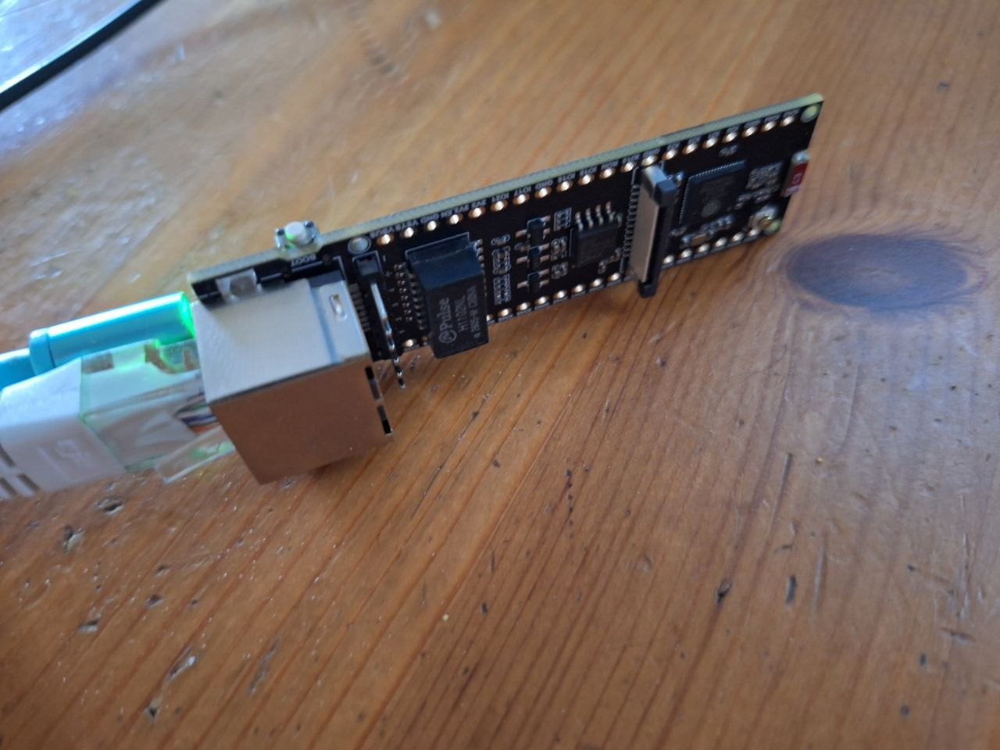
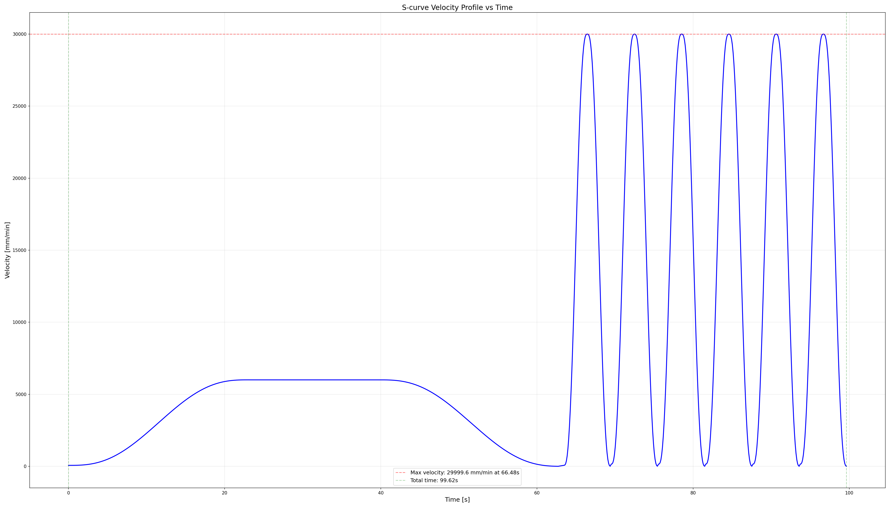
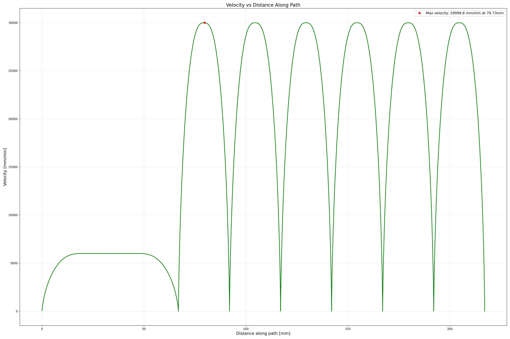
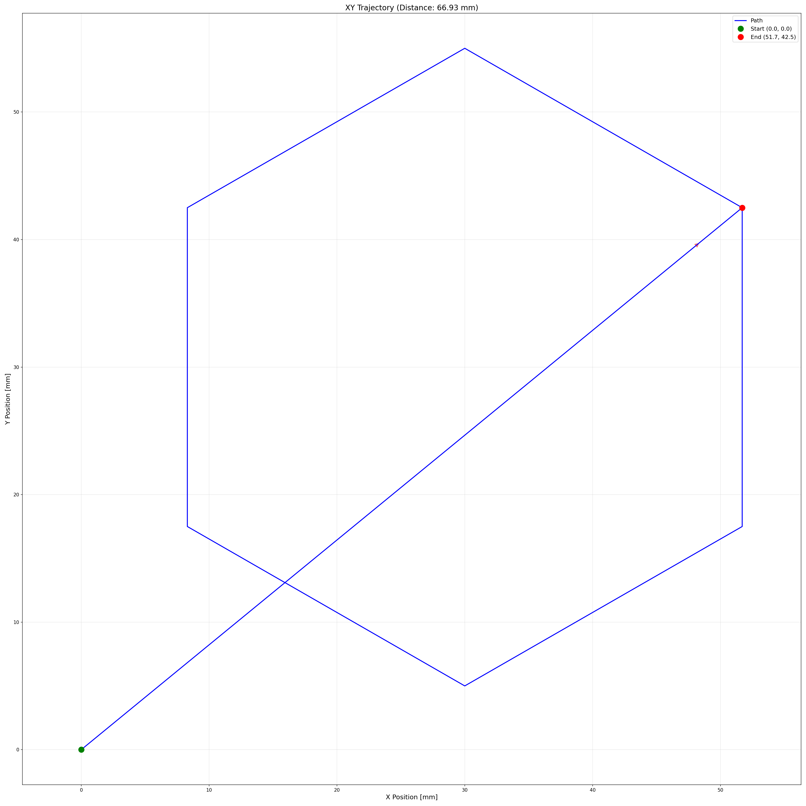

# Двухосевой станок ЧПУ на ESP32-S3

## 1. Описание

Проект для  ESP32-S3, реализующий управление двухосевым механизмом по протоколу, совместимому с Laser GRBL (G-коды). Устройство должно обеспечивать плавное движение с S-образным разгоном/торможением, принимать команды по Ethernet (UDP) и UART, и мгновенно пересчитывать траекторию при поступлении новой команды.

## 2. Управление движением (Motion Control)
1. **Оси**: 2 оси (A и B), управление шаговыми двигателями через драйверы (STEP/DIR).  
Тип движений:

2. **Позиционирование (G0/G1)**: Перемещение в абсолютные/относительные координаты с заданной скоростью.
Непрерывное вращение: Команда вращения с заданной угловой скоростью (по сути, бесконечное движение без конечной точки).  

3. **Профиль скоростей**: S-Curve (полиномиальный или тригонометрический профиль) для всех фаз движения:  
 - Разгон (старт)
 - Установившаяся скорость
 - Торможение (стоп)

 ## 3. Обработка команд (Real-time)
1. **Мгновенное обновление**: При поступлении новой команды, старая команда немедленно прерывается, и начинается пересчет траектории от текущей физической позиции к новой целевой точке.

2. **Приоритет**: Новая команда имеет абсолютный приоритет над текущей.  

3. Интерфейсы связи
**UART**: Скорость до 115200 (или выше), стандартный протокол GRBL.  
**Ethernet (UDP)**:
- Получение G-кодов по UDP (широковещательный или направленный трафик). 
- Отправка статусных сообщений и подтверждений обратно клиенту. 
- Подтверждение (Handshake): На каждую прилетевшую команду (по UDP и UART) устройство обязано отправить подтверждение (ok или error:<код>).

## 4. Генерация импульсов (Stepping)
Использование таймера ESP32-S3  для генерации STEP/DIR-импульсов.

# Использованное оборудование и софт

Для проекта использована аналог платы [ESP32-S3-ETH](https://www.waveshare.com/esp32-s3-eth.htm?srsltid=AfmBOopPZeZcTsBZvzxZFlleu8cFTIndNpnVzzSbYrATIGDTH3OGj9cu) от wiveshare.
Подключение было через USB-C - для отладки по встроенному JTAG и через RJ45 на плате для реализации 
физического уровня TCP-IP. Так же использован роутер Keenteic extra 3300(может быть использован любой) без доступа к интернету и служащий маршрутизатором между рабочей станций (ПК, где запускается клиент GRBL и ESP32S3ETH - на которой реализован UDP сервер GRBL получающий команды и выполняющий их).
 Для создания, сборки и отладки проекта был использован VS Code с установленным плагином ESP_IDF.

# Сборка и запуск

При создании проекта использована версия ESP-IDF 6.0.2. Для сборки зайти в репозиторий
```bash
cd esp32_cnc/
```
очистить если собирался ранее
```bash
idf.py clean
```
собираем проект
```bash
idf.py build
```
прошиваем устройство
```bash
idf.py -p /dev/ttyACM0 flash
```

запускаем мониторинг через UART0 по USB
```bash
idf.py -p /dev/ttyACM0 monitor
```
Дожидаемся когда получим ip адрес от сервера(192.168.1.1)
```bash
......
I (767) main_task: Started on CPU0
I (767) esp_psram: Reserving pool of 32K of internal memory for DMA/internal allocations
I (777) main_task: Calling app_main()
I (797) esp_eth.netif.netif_glue: 2a:84:85:53:c5:14
I (797) esp_eth.netif.netif_glue: ethernet attached to netif
I (807) ethernet_init: Waiting for IP address...
```
После получения можно отправлять GRBL команды на выполнение сервером:
```bash
I (4067) esp_netif_handlers: eth ip: 192.168.1.85, mask: 255.255.255.0, gw: 192.168.1.1
I (4067) ethernet_init: Ethernet Got IP Address
I (4067) ethernet_init: ~~~~~~~~~~~
I (4067) ethernet_init: ETHIP:192.168.1.85
I (4067) ethernet_init: ETHMASK:255.255.255.0
I (4077) ethernet_init: ETHGW:192.168.1.1
I (4077) ethernet_init: ~~~~~~~~~~~
I (4077) MOT_PLAN: Motion controller initialized
I (4087) udp_grbl_server: UDP Server listening on port 8080

```
запускаем другой терминал на рабочей станции для отправки команд esp32 серверу и выполняем
отправку шестиугольника, треугольника.
```bash
cd esp32_cnc/
python3 send_hexagon.py
python3 send_triangle.py
```

тем временем в терминале с  UART0 по USB
```bash
I (29457) udp_grbl_server: Received 4 bytes from 192.168.1.101:38897: G90

I (29457) udp_grbl_server: CMD queued: ABSOLUTE
I (29457) udp_grbl_server: Received 4 bytes from 192.168.1.101:38897: G21

I (29467) udp_grbl_server: CMD queued: ARC
I (29467) udp_grbl_server: Received 15 bytes from 192.168.1.101:38897: G0 X51.7 Y42.5

I (29477) udp_grbl_server: CMD queued: LINEAR
I (29477) udp_grbl_server: Received 20 bytes from 192.168.1.101:38897: G1 X51.7 Y42.5 F500

I (29487) MOT_PLAN: === mp_aline() START: target=(51.70, 42.50), feed=100.00 ===
I (29487) udp_grbl_server: CMD queued: LINEAR
I (29497) udp_grbl_server: Received 20 bytes from 192.168.1.101:38897: G1 X30.0 Y55.0 F500

I (29507) udp_grbl_server: CMD queued: LINEAR
I (29507) MOT_PLAN:   mm.position = (0.00, 0.00)
I (29507) udp_grbl_server: Received 19 bytes from 192.168.1.101:38897: G1 X8.3 Y42.5 F500

I (29517) udp_grbl_server: CMD queued: LINEAR
I (29527) udp_grbl_server: Received 19 bytes from 192.168.1.101:38897: G1 X8.3 Y17.5 F500

I (29537) udp_grbl_server: CMD queued: LINEAR
I (29537) MOT_PLAN:   bf.length = 66.9264
I (29537) udp_grbl_server: Received 19 bytes from 192.168.1.101:38897: G1 X30.0 Y5.0 F500

I (29547) udp_grbl_server: CMD queued: LINEAR
I (29557) udp_grbl_server: Received 20 bytes from 192.168.1.101:38897: G1 X51.7 Y17.5 F500

I (29567) udp_grbl_server: CMD queued: LINEAR
I (29567) MOT_PLAN:   bf.gm.move_time = 0.669264 min
I (29567) udp_grbl_server: Received 20 bytes from 192.168.1.101:38897: G1 X51.7 Y42.5 F500

I (29577) udp_grbl_server: CMD queued: LINEAR
I (29577) MOT_PLAN:   bf.jerk = 32.36, axis=0
I (29587) MOT_PLAN:   speeds: entry=1.10, cruise=100.00, exit=0.00
I (29587) MOT_PLAN:   lengths: head=19.4775, body=27.7549, tail=19.6939
I (29597) MOT_PLAN:   mr.segments = 8032
I (29597) MOT_PLAN: Move planned: target=(51.70, 42.50), length=66.93, time=0.669 min, jerk=32.36, segments=8032
I (29607) udp_grbl_server: Planner: move started to (51.70, 42.50, 100.00)
I (29617) MOT_EXECUTE: MOVE START
I (29617) MOT_EXECUTE: pos_x_mm:pos_y_mm:vel_mm_min:T_ms:dt_ms
I (29627) MOT_EXECUTE: 0.000:0.000:65.92:28886:28886
I (29727) MOT_EXECUTE: 0.002:0.001:65.93:28991:104
I (29827) MOT_EXECUTE: 0.003:0.003:65.97:29091:100
I (29927) MOT_EXECUTE: 0.005:0.004:66.07:29191:100
I (30027) MOT_EXECUTE: 0.006:0.005:66.26:29291:100
I (30127) MOT_EXECUTE: 0.007:0.006:66.56:29391:100
I (30227) MOT_EXECUTE: 0.009:0.007:67.01:29491:100
I (30327) MOT_EXECUTE: 0.010:0.008:67.61:29591:100
I (30427) MOT_EXECUTE: 0.012:0.010:68.41:29691:100
I (30527) MOT_EXECUTE: 0.013:0.011:69.41:29791:100
I (30627) MOT_EXECUTE: 0.015:0.012:70.65:29891:100
I (30727) MOT_EXECUTE: 0.016:0.013:72.15:29991:100
I (30827) MOT_EXECUTE: 0.018:0.015:73.92:30091:100
I (30927) MOT_EXECUTE: 0.019:0.016:75.98:30191:100
I (31027) MOT_EXECUTE: 0.021:0.017:78.37:30291:100
I (31127) MOT_EXECUTE: 0.023:0.019:81.09:30391:100
I (31227) MOT_EXECUTE: 0.025:0.020:84.17:30491:100
I (31327) MOT_EXECUTE: 0.026:0.022:87.62:30591:100
I (31427) MOT_EXECUTE: 0.028:0.023:91.46:30691:100
I (31527) MOT_EXECUTE: 0.030:0.025:95.70:30791:100
I (31627) MOT_EXECUTE: 0.032:0.027:100.37:30891:100
I (31727) MOT_EXECUTE: 0.035:0.028:105.48:30991:100
I (31827) MOT_EXECUTE: 0.037:0.030:111.04:31091:100
I (31927) MOT_EXECUTE: 0.039:0.032:117.06:31191:100
.....
.....
.....

```

когда выполнение команд закончится
```bash
....
....
....
I (127447) MOT_EXECUTE: 51.700:38.683:21599.60:126708:100
I (127547) MOT_EXECUTE: 51.700:39.258:19894.65:126808:100
I (127647) MOT_EXECUTE: 51.700:39.785:18104.41:126908:100
I (127747) MOT_EXECUTE: 51.700:40.260:16259.70:127008:100
I (127847) MOT_EXECUTE: 51.700:40.684:14392.79:127108:100
I (127947) MOT_EXECUTE: 51.700:41.057:12536.59:127208:100
I (128047) MOT_EXECUTE: 51.700:41.378:10723.67:127308:100
I (128147) MOT_EXECUTE: 51.700:41.650:8985.48:127408:100
I (128247) MOT_EXECUTE: 51.700:41.876:7351.42:127508:100
I (128347) MOT_EXECUTE: 51.700:42.057:5847.99:127608:100
I (128447) MOT_EXECUTE: 51.700:42.200:4497.90:127708:100
I (128547) MOT_EXECUTE: 51.700:42.307:3319.22:127808:100
I (128647) MOT_EXECUTE: 51.700:42.384:2324.48:127908:100
I (128747) MOT_EXECUTE: 51.700:42.437:1519.80:128008:100
I (128847) MOT_EXECUTE: 51.700:42.469:904.04:128108:100
I (128947) MOT_EXECUTE: 51.700:42.488:467.89:128208:100
I (129047) MOT_EXECUTE: 51.700:42.496:193.03:128308:100
I (129147) MOT_EXECUTE: 51.700:42.499:51.22:128408:100
I (129247) MOT_EXECUTE: 51.700:42.500:3.47:128508:100
I (129317) MOT_EXECUTE: MOVE COMPLETED AT (51.70, 42.50)

```

копируем лог и заходим в папку
```bash
 cd python_scripts/
```
вставляем его в фаил cnc_server.log
и запускаем парсинг для построения графиков
```bash
python3 plot_motion.py
```
в папке /esp32_cnc/python_scripts/movement_plots
появятся следующие графики:
1. **скорости от времени**
     
 
2. **скорости от перемещения**
   

3. **перемещения по двум координатам**
     

